# Curve Coupling

A package for curve coupling analysis. This package helps finding the solution for a coupling of N curves with N-1 constraints (which gives a curve as a solution). In particular, this is used to compute the equilibrium points of a network of nonlinear compliant elements and their stability.

Made at: [Soft Robotics Group @ KU Leuven](https://softroboticsgroup.com/)

## Overview

Curve Coupling is a Python package designed for analyzing and solving curve coupling problems. It provides tools for solving curve coupling problems with constraints. Applied to networks nonlinear of compliant elements, this package allows to

- Find the system constriants from its graph structure.
- Compute the equilibirum points.
- Find isolated islands.
- Find singularities and branching points.
- Compute the stability of the elements and the network
- Visualizing the results.

### Equality problem

In the equality case, the constraint is that some dimension of the input curves must be equal. For example for a match dimension $k$, the constraints are

```math
c_{0,k}(t_0) = c_{1,k}(t_1) = \dots = c_{N,k}(t_N).
```

The output for a solution point is just the average of the inputs,

```math
c_\mathrm{out}(t_0,t_1,\dots,t_N)=\frac{1}{N} \sum_i c_i(t_i).
```

### General problem
In the general case, we define a constraint array $\mathbf{M}_C\in\mathbb{R}^{(N-1)\times N \times d}$, and constraint vector $\mathbf{V}_C\in\mathbb{R}^{(N-1)}$, where $d$ is the dimension of the curves (generally 2, like force-displacement, current-voltage, etc.). In that case, the constraints are:

```math
e_i=\sum_{j,k} \mathbf{M}_{C_{i,j,k}}\,c_{j,k}(t_j) + \mathbf{V}_{C_i}= 0.
```

Similarly, we define the output array $\mathbf{M}_O\in\mathbb{R}^{d_o\times N \times d}$, and output vector $\mathbf{V}_O\in\mathbb{R}^{d_o}$, where $d_o$ is the dimension of the output (generally the same as the inputs). In that case, the output is:

```math
c_{\mathrm{out}_i}(t_0,t_1,\dots,t_N)=\sum_{j,k} \mathbf{M}_{O_{i,j,k}}\,c_{j,k}(t_j) + \mathbf{V}_{O_i}.
```

### Solution

In both cases, given an initial seed point, the solution is computed in the parametric space by a continuation algorithm based on computing the tangent to the solution at each step.

### Example

As an example, we consider the constraints

```math
\left[c_{0,0}(t_0) - c_{1,0}(t_1) - c_{2,0}(t_2); \, c_{1,1}(t_1) - c_{2,1}(t_2) \right]= \left[0;\,0\right],
```

and output

```math
c_\mathrm{out}(t_0,t_1,t_2) = \left[c_{0,0}(t_0);\, c_{0,1}(t_0) + c_{1,1}(t_1)\right].
```

The continuation algorithm solution process can be seen below.

<p align="center">
  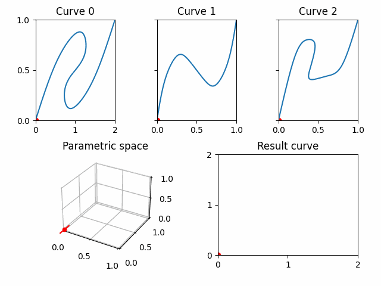
</p>

### Compliant elements network

Finding the equlibrium points of networks of non-linear compliant elements can be seen as a curve coupling problem. Therefore, the package provides tools to compute the network constraints and output arrays from the network graph, as well as computing the stability of the found equilibrium points from the stability of the individual elements.

## Installation

To install the package, use `pip`:

```sh
pip install -e .
```

This installs the package in editable mode, allowing modifications to the source code to take effect immediately.

## Usage: curve coupling

### Generating Curves

You can generate curves using the built-in functions:

```python
import numpy as np
from curveCoupling.curveGenerators import generate_curve_CubicSpline, generate_curve_Pchip, generate_curve_snaps

p0 = np.array([[0.0, 0.0], [0.2, 0.62], [0.35, 0.8], [0.45, 0.78], [0.45, 0.67], [0.4, 0.52], [0.4, 0.41], [0.6, 0.44], [0.8, 0.55], [1.0, 1.0]])
data = [
    generate_curve_CubicSpline(p0, 200),
    generate_curve_Pchip(p0, 200),
    generate_curve_snaps(p0, 200)
]
```

Comparison of generated curves:

<p align="center">
  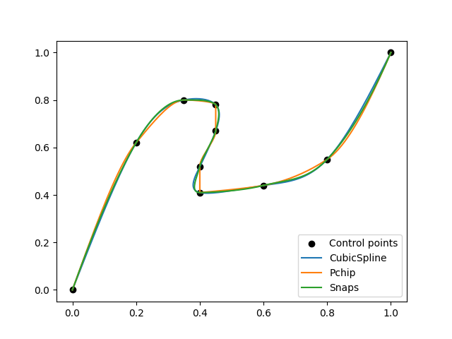
</p>

### Interpolating and extrpolating Curves

Generate a function that interpolates and extrapolates data points as a parametric curve using the class `ndcurves`:

```python
import numpy as np
from curveCoupling.curveGenerators import generate_curve_CubicSpline
from curveCoupling import ndcurve

p0 = np.array([[0.0, 0.0], [0.2, 0.62], [0.35, 0.8], [0.45, 0.78], [0.45, 0.67], [0.4, 0.52], [0.4, 0.41], [0.6, 0.44], [0.8, 0.55], [1.0, 1.0]])
data = generate_curve_CubicSpline(p0, 200)

curve = ndcurve(data)
t = np.linspace(0.0,1.0,200)
values = curve(t)
deriv = curve(t, nu=1)
```

Resulting values:

<p align="center">
  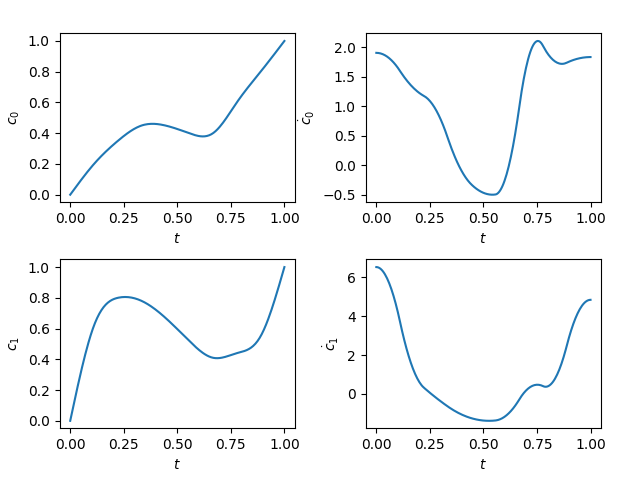
</p>

### Solving Curve Coupling Problems (Equality)

Solve curve coupling problems efficiently (in case of equality constraints):

```python
import numpy as np
from curveCoupling.curveGenerators import generate_curve_peaks
from curveCoupling import ndcurve, curveCouplingProblem_Equality, solveCurveCoupling_Equality, solveCurveCoupling_bruteForce_localSolve

p0 = np.array([[0.0, 0.0], [0.3, 0.9], [0.7, 0.3], [1.0, 1.0]])
p1 = np.array([[0.0, 0.0], [0.2, 0.5], [0.6, 0.2], [1.0, 1.0]])
p2 = np.array([[0.0, 0.0], [0.2, 0.7], [0.6, 0.1],
                [0.7, 0.4], [0.8, 0.35], [1.0, 1.0]])
points = [p0, p1, p2]
data = [generate_curve_peaks(pts, 200) for pts in points]

match_index = 1
curves = ndcurve.createList(data)
prob_eq = curveCouplingProblem_Equality(curves, match_index)

out, res = solveCurveCoupling_Equality(prob_eq)
out_brute, res_brute = solveCurveCoupling_bruteForce_localSolve(prob_eq, iter_points=10)
```

Comparison with brute force results, we are missing the islands.

<p align="center">
  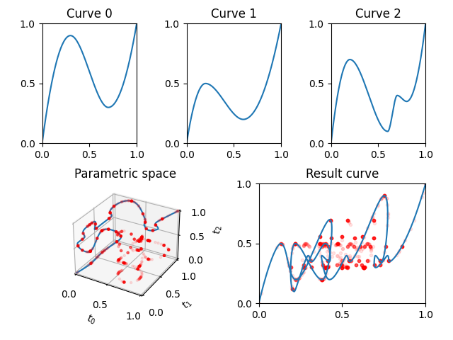
</p>

### Finding islands in Curve Coupling Problems (Equality)

Find islands in curve coupling problems efficiently (in case of equality constraints):

```python
import numpy as np
from curveCoupling.curveGenerators import generate_curve_peaks
from curveCoupling import ndcurve, curveCouplingProblem_Equality, solveCurveCoupling_bruteForce_localSolve
from curveCoupling.curveCoupling_Analysis import solveCurveCoupling_Islands_Equality


p0 = np.array([[0.0, 0.0], [0.3, 0.9], [0.7, 0.3], [1.0, 1.0]])
p1 = np.array([[0.0, 0.0], [0.2, 0.5], [0.6, 0.2], [1.0, 1.0]])
p2 = np.array([[0.0, 0.0], [0.2, 0.7], [0.6, 0.1],
                [0.7, 0.4], [0.8, 0.35], [1.0, 1.0]])
points = [p0, p1, p2]
data = [generate_curve_peaks(pts, 200) for pts in points]
match_index = 1

curves = ndcurve.createList(data)
prob = curveCouplingProblem_Equality(curves, match_index)

out_lst, res_lst = solveCurveCoupling_Islands_Equality(prob)
```

We now get the islands.

<p align="center">
  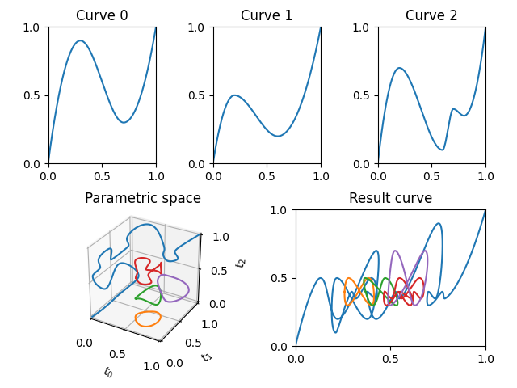
</p>

### Dealing with singularities in Curve Coupling Problems (Equality)

Deal with singularities in curve coupling problems efficiently (in case of equality constraints):

```python
import numpy as np
from curveCoupling.curveGenerators import generate_curve_peaks
from curveCoupling import ndcurve, curveCouplingProblem_Equality, solveCurveCoupling_bruteForce_localSolve
from curveCoupling.curveCoupling_Analysis import solveCurveCoupling_Singularities_Equality, findSingularities_Equality

p0 = np.array([[0.0, 0.0], [0.3, 0.9], [0.7, 0.3], [1.0, 1.0]])
p1 = np.array([[0.0, 0.0], [0.2, 0.6], [0.6, 0.3], [1.0, 1.0]])
p2 = np.array([[0.0, 0.0], [0.2, 0.7], [0.6, 0.3],
                [0.7, 0.5], [0.8, 0.4], [1.0, 1.0]])

points = [p0, p1, p2]
data = [generate_curve_peaks(pts, 200) for pts in points]
match_index = 1

curves = ndcurve.createList(data)
prob = curveCouplingProblem_Equality(curves, match_index)

sing_out, sing_seeds, sing_orders, sing_dirs = findSingularities_Equality(prob, tol=1e-3)
out_lst, res_lst = solveCurveCoupling_Singularities_Equality(prob, tol=1e-3)
```

We get the different branches from the singular points.

<p align="center">
  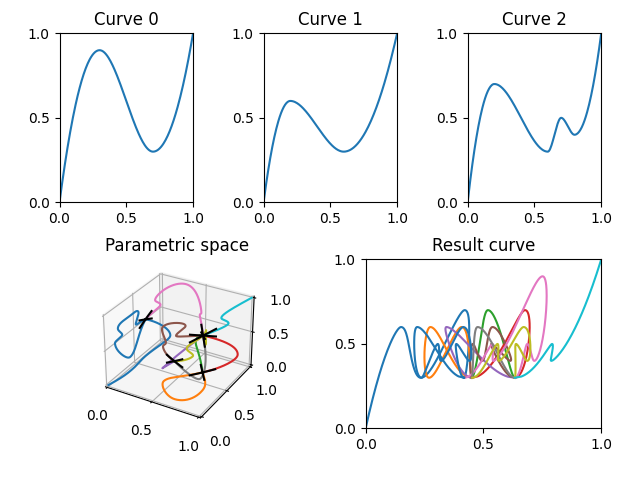
</p>

### Solving Curve Coupling Problems (General)

Solve curve coupling problems efficiently (in case of general constraints):

```python
import numpy as np
from curveCoupling.curveGenerators import generate_curve_CubicSpline
from curveCoupling import ndcurve, curveCouplingProblem, solveCurveCoupling, solveCurveCoupling_bruteForce_localSolve

p0 = np.array([[0.0, 0.0], [0.55,0.6], [1.1, 0.88], [1.27, 0.72], [1.1,0.55]])
p0 = np.concatenate([p0, [2.0,1.0]-np.flip(p0,axis=0)])
p1 = np.array([[0.0, 0.0], [0.1, 0.4], [0.25, 0.64], [0.4, 0.6]])
p1 = np.concatenate([p1, [1.0,1.0]-np.flip(p1,axis=0)])
p2 = np.array([[0.0, 0.0], [0.2, 0.62], [0.35, 0.8], [0.45, 0.78], [0.45, 0.67], [0.4, 0.52], [0.4, 0.41], [0.6, 0.44], [0.8, 0.55], [1.0, 1.0]])
points = [p0, p1, p2]
data = [generate_curve_CubicSpline(pts, 200) for pts in points]

curves = ndcurve.createList(data)
constraint_matrices = np.zeros((len(data)-1, len(data), data[0].shape[1]))
output_matrices = np.zeros((data[0].shape[1], len(data), data[0].shape[1]))

constraint_matrices[0,:,0] = np.array([1.0,-1.0,-1.0])
constraint_matrices[1,:,1] = np.array([0.0,1.0,-1.0])
output_matrices[0,:,0] = np.array([1.0,0.0,0.0])
output_matrices[1,:,1] = np.array([1.0,1.0,0.0])

prob = curveCouplingProblem(curves, constraint_matrices, output_matrices)

out, res = solveCurveCoupling(prob)
out_brute, res_brute = solveCurveCoupling_bruteForce_localSolve(prob, iter_points=10)
```

Comparison with brute force results, we are missing the islands.

<p align="center">
  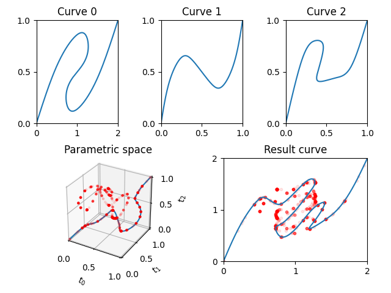
</p>

### Finding islands in Curve Coupling Problems (General)

Find islands in curve coupling problems efficiently (in case of general constraints):

```python
import numpy as np
from curveCoupling import ndcurve, curveCouplingProblem, solveCurveCoupling_bruteForce_localSolve
from curveCoupling.curveCoupling_Analysis import solveCurveCoupling_Islands
    
p0 = np.array([[0.0, 0.0], [0.55,0.6], [1.1, 0.88], [1.27, 0.72], [1.1,0.55]])
p0 = np.concatenate([p0, [2.0,1.0]-np.flip(p0,axis=0)])
p1 = np.array([[0.0, 0.0], [0.1, 0.4], [0.25, 0.64], [0.4, 0.6]])
p1 = np.concatenate([p1, [1.0,1.0]-np.flip(p1,axis=0)])
p2 = np.array([[0.0, 0.0], [0.2, 0.62], [0.35, 0.8], [0.45, 0.78], [0.45, 0.67], [0.4, 0.52], [0.4, 0.41], [0.6, 0.44], [0.8, 0.55], [1.0, 1.0]])
points = [p0, p1, p2]
data = [generate_curve_CubicSpline(pts, 200) for pts in points]

curves = ndcurve.createList(data)
constraint_matrices = np.zeros((len(data)-1, len(data), data[0].shape[1]))
output_matrices = np.zeros((data[0].shape[1], len(data), data[0].shape[1]))

constraint_matrices[0,:,0] = np.array([1.0,-1.0,-1.0])
constraint_matrices[1,:,1] = np.array([0.0,1.0,-1.0])
output_matrices[0,:,0] = np.array([1.0,0.0,0.0])
output_matrices[1,:,1] = np.array([1.0,1.0,0.0])

prob = curveCouplingProblem(curves, constraint_matrices, output_matrices)
out_lst, res_lst = solveCurveCoupling_Islands(prob)
```

We now get the islands.

<p align="center">
  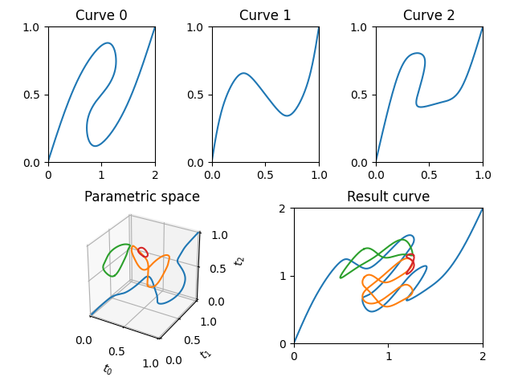
</p>

### Dealing with singularities in Curve Coupling Problems (General)

Deal with singularities in curve coupling problems efficiently (in case of general constraints):

```python
import numpy as np
from curveCoupling.curveGenerators import generate_curve_snaps
from curveCoupling import ndcurve, curveCouplingProblem, solveCurveCoupling_bruteForce_localSolve
from curveCoupling.curveCoupling_Analysis import solveCurveCoupling_Singularities, findSingularities    

p0 = np.array([[0.0, 0.0], [0.5,0.6], [1.1, 0.9], [1.35, 0.75], [1.1,0.55]])
p0 = np.concatenate([p0, [2.0,1.0]-np.flip(p0,axis=0)])
p1 = np.array([[0.0, 0.0], [0.3, 0.6], [0.7, 0.4], [1.0, 1.0]])
p2 = np.array([[0.0, 0.0], [0.2, 0.65], [0.35, 0.8], [0.46, 0.75], [0.43, 0.61], [0.38, 0.45], [0.6, 0.4], [0.85, 0.6], [1.0, 1.0]])
points = [p0, p1, p2]
data = [generate_curve_snaps(pts, 200) for pts in points]

curves = ndcurve.createList(data)
constraint_matrices = np.zeros((len(data)-1, len(data), data[0].shape[1]))
output_matrices = np.zeros((data[0].shape[1], len(data), data[0].shape[1]))

constraint_matrices[0,:,0] = np.array([1.0,-1.0,-1.0])
constraint_matrices[1,:,1] = np.array([0.0,1.0,-1.0])
output_matrices[0,:,0] = np.array([1.0,0.0,0.0])
output_matrices[1,:,1] = np.array([1.0,1.0,0.0])
prob = curveCouplingProblem(curves, constraint_matrices, output_matrices)

sing_outs, sing_seeds, sing_orders, sing_dirs = findSingularities(prob, 10, tol=1e-3)
out_lst, res_lst = solveCurveCoupling_Singularities(prob, tol=1e-3)
```

We get the different branches from the singular points.

<p align="center">
  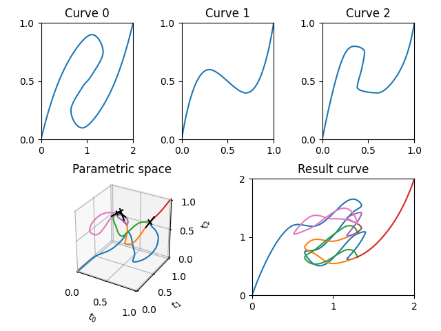
</p>

### Inverting a separable problem

In the case of separable problems, the problem can be inverted to find the input that would generate a given output. For this we need that:

- Each contraint applies to only one dimension of the curves (the same for all curves):
```math
e_k (t_0, t_1, \dots, t_N) = \sum_i a_{i,k}\, c_{d(i),k}(t_i).
```
- The output is of the same dimension as the inputs and each component is a linear combination of the input components:
```math
c_{\mathrm{out}_k}(t_0, t_1, \dots, t_N) = \sum_i b_{i,k}\, c_{i,k}(t_i).
```
- The system must sufficiently constraint the input to compute. For example, if the direct problem is independent of one component of the curve to compute, then the inverse proble will be undetermined since this component cuold take any value.

Although not all problems are separable, most physical systems arising from interactions satisfy these conditions since. For example, in compliant elements networks, forces are compared to forces and displacements to displacements. 

```python
import numpy as np
from curveCoupling.curveGenerators import *
from curveCoupling import ndcurve, curveCouplingProblem, solveCurveCoupling
from curveCoupling.separableEqs import separableEqs

p0 = np.array([[0.0, 0.0], [0.55, 0.6], [1.1, 0.88], [1.27, 0.72], [1.1, 0.55]])
p0 = np.concatenate([p0, [2.0, 1.0] - np.flip(p0, axis=0)])
p1 = np.array([[0.0, 0.0], [0.1, 0.4], [0.25, 0.64], [0.4, 0.6]])
p1 = np.concatenate([p1, [1.0, 1.0] - np.flip(p1, axis=0)])
p2 = np.array([[0.0, 0.0], [0.2, 0.62], [0.35, 0.8], [0.45, 0.78], [0.45, 0.67], [0.4, 0.52], [0.4, 0.41], [0.6, 0.44], [0.8, 0.55], [1.0, 1.0]])
points = [p0, p1, p2]
data = [generate_curve_CubicSpline(pts, 200) for pts in points]
curves = ndcurve.createList(data)

constraint_matrices = np.zeros((len(data)-1, len(data), data[0].shape[1]))
output_matrices = np.zeros((data[0].shape[1], len(data), data[0].shape[1]))
constraint_matrices[0,:,0] = np.array([1.0,-1.0,-1.0])
constraint_matrices[1,:,1] = np.array([0.0,1.0,-1.0])
output_matrices[0,:,0] = np.array([1.0,0.0,0.0])
output_matrices[1,:,1] = np.array([1.0,1.0,0.0])

prob = curveCouplingProblem(curves, constraint_matrices, output_matrices)
eqs = separableEqs.from_jointMatrices(constraint_matrices, output_matrices)
out, res = solveCurveCoupling(prob)

# Solve for curve 0 to get the computed output
solve_for_idx = 0
eqs_inverse = eqs.invertProblem(0)
curves_inverse = curves.copy()
curves_inverse[solve_for_idx] = ndcurve(out)
prob_inverse = curveCouplingProblem(curves_inverse, eqs_inverse.getConstraintMatrices(), eqs_inverse.getOutputMatrices())
out_inverse, res_inverse = solveCurveCoupling(prob_inverse)
```

The direct problem results:
<p align="center">
  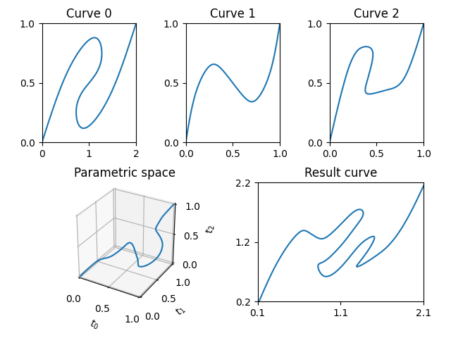
</p>

Then, we invert the problem to compute the necessary curve to get the computed output. For this, we invert he equations and the roles of the output and input curve. This works to recompute any of the desired curves.

<p align="center">
  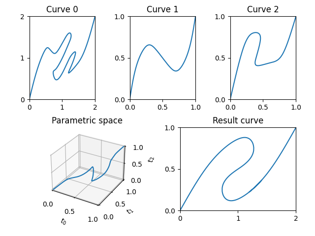
</p>

<p align="center">
  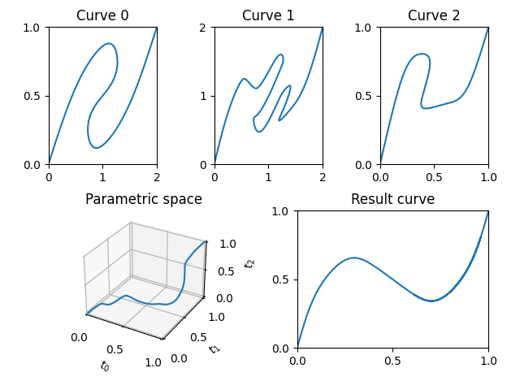
</p>

<p align="center">
  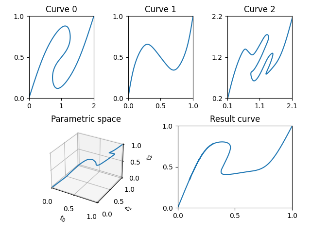
</p>

### Plotting Results

Visualize curve coupling results with `matplotlib`:

```python
import matplotlib.pyplot as plt
from matplotlib import gridspec

fig = plt.figure()
plot_h = 2
gs = gridspec.GridSpec(2, plot_h * len(data))
axs = []

for i in range(0, len(data)):
    axs.append(fig.add_subplot(gs[0, plot_h * i:plot_h * (i + 1)]))
axs.append(fig.add_subplot(gs[1, len(data):]))
axs.append(fig.add_subplot(gs[1, :len(data)], projection='3d'))

for i, d in enumerate(data):
    axs[i].plot(d[:, 0], d[:, 1])
for res in res_lst:
    axs[-1].plot(res[:, 0], res[:, 1], res[:, 2])
axs[-1].scatter(res_brute[:, 0], res_brute[:, 1], res_brute[:, 2], color='r', marker ='.',alpha=0.1)

for out in out_lst:
    axs[-2].plot(out[:, 0], out[:, 1])
axs[-2].scatter(out_brute[:, 0], out_brute[:, 1], color='r', marker ='.',alpha=0.1)

plt.show()
```

Alternatively, use the provided default plot:
```python
from curveCoupling.utils.defaultPlots import plotResults

fig = plt.figure()
axs = plotResults(fig, data, out_lst, res_lst, out_brute, res_brute)
plt.show(block=False)
```

## Usage: compliant elements networks

### Getting contraints from graph

Define a graph of the compliant elemnets network and compute the constraints and output matrices.

```python
from curveCoupling.compliantElements import generate_network_equations, force_disp_to_matrices

edges = [
    ('Start', 'A'),
    ('A', 'B'),
    ('B', 'End'),
    ('Start', 'B'),
    ('A', 'End'),
]

disp_constr, force_constr, disp_out, force_out = generate_network_equations(edges)
ConstraintMatrices, OutputMatrices = generate_network_equations(edges, return_in_joint_matrices=True)
```

In the example, the graph is:
```text
  Start
    |
-----
|   |
|   1
|   |
4   A----
|   |   |
|   2   |
|   |   |
----B   5
    |   |
    3   |
    |   |
    |----
    |
   End
```

The output is:
```console
disp_constr:
 [[-1. -1.  0.  1.  0.]
 [ 0. -1. -1.  0.  1.]]

force_constr:
 [[ 0. -1.  1. -1.  0.]
 [-1.  1.  0.  0.  1.]]

disp_out:
 [0. 0. 1. 1. 0.]

force_out:
 [1. 0. 0. 1. 0.]

ConstraintMatrices:
 [[[-1.  0.]
  [-1.  0.]
  [ 0.  0.]
  [ 1.  0.]
  [ 0.  0.]]

 [[ 0.  0.]
  [-1.  0.]
  [-1.  0.]
  [ 0.  0.]
  [ 1.  0.]]

 [[ 0.  0.]
  [ 0. -1.]
  [ 0.  1.]
  [ 0. -1.]
  [ 0.  0.]]

 [[ 0. -1.]
  [ 0.  1.]
  [ 0.  0.]
  [ 0.  0.]
  [ 0.  1.]]]

OutputMatrices:
 [[[0. 0.]
  [0. 0.]
  [1. 0.]
  [1. 0.]
  [0. 0.]]

 [[0. 1.]
  [0. 0.]
  [0. 0.]
  [0. 1.]
  [0. 0.]]]
```

### Computing stability of an element

Compute stability of an element from its force-displacement curve:

```python
import numpy as np
from curveCoupling.curveGenerators import generate_curve_CubicSpline
from curveCoupling.compliantElements import getEigenVals, eigen2stability

p0 =  np.array([[0.0, 0.0], [0.2, 0.62], [0.35, 0.8], [0.45, 0.78], [0.45, 0.67], [0.4, 0.52], [0.4, 0.41], [0.6, 0.44], [0.8, 0.55], [1.0, 1.0]])
data = generate_curve_CubicSpline(p0, 200)
eigen = getEigenVals(data)
stability = eigen2stability(eigen)
```

We get the input stability evolution along the curve, assuming the initial point is stable.

<p align="center">
  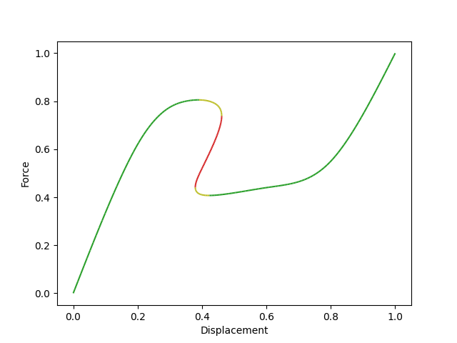
</p>

### Computing stability of a network (Equality)

Compute stability of a network from components (in case of equality constraints):

```python
import numpy as np
from curveCoupling.curveGenerators import generate_curve_peaks
from curveCoupling import ndcurve, curveCouplingProblem_Equality
from curveCoupling.curveCoupling_Analysis import solveCurveCoupling_Islands_Equality
from curveCoupling.compliantElements import getEigenVals, getEigen_coupling_analytic_Equality, eigen2stability


p0 = np.array([[0.0, 0.0], [0.3, 0.9], [0.7, 0.3], [1.0, 1.0]])
p1 = np.array([[0.0, 0.0], [0.2, 0.5], [0.6, 0.2], [1.0, 1.0]])
p2 = np.array([[0.0, 0.0], [0.2, 0.7], [0.6, 0.1],
                [0.7, 0.4], [0.8, 0.35], [1.0, 1.0]])
points = [p0, p1, p2]
data = [generate_curve_peaks(pts, 200) for pts in points]
match_index = 1

curves = ndcurve.createList(data)
prob = curveCouplingProblem_Equality(curves,match_index)

out_lst, res_lst = solveCurveCoupling_Islands_Equality(prob)

eigen_input_lst = [getEigenVals(d) for d in data]
stability_input_lst = [eigen2stability(e) for e in eigen_input_lst]
eigen_analytic_lst = [getEigen_coupling_analytic_Equality(prob, r) for r in res_lst]
stability_analytic_lst = [eigen2stability(e) for e in eigen_analytic_lst]
```

We get the input and output stabilities, including islands.

<p align="center">
  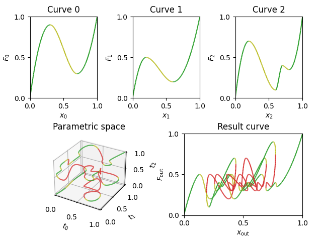
</p>

### Computing stability of a network (General)

Compute stability of a network from components (in case of general constraints):

```python
import numpy as np
from curveCoupling.curveGenerators import generate_curve_CubicSpline
from curveCoupling import ndcurve, curveCouplingProblem
from curveCoupling.curveCoupling_Analysis import solveCurveCoupling_Islands
from curveCoupling.compliantElements import getEigenVals, getEigen_coupling_analytic, eigen2stability, generate_circuit_equations

p0 = np.array([[0.0, 0.0], [0.55, 0.6], [1.1, 0.88], [1.27, 0.72], [1.1, 0.55]])
p0 = np.concatenate([p0, [2.0, 1.0] - np.flip(p0, axis=0)])
p1 = np.array([[0.0, 0.0], [0.1, 0.4], [0.25, 0.64], [0.4, 0.6]])
p1 = np.concatenate([p1, [1.0, 1.0] - np.flip(p1, axis=0)])
p2 = np.array([[0.0, 0.0], [0.2, 0.62], [0.35, 0.8], [0.45, 0.78], [0.45, 0.67], [0.4, 0.52], [0.4, 0.41], [0.6, 0.44], [0.8, 0.55], [1.0, 1.0]])
points = [p0, p1, p2]
data = [generate_curve_CubicSpline(pts, 200) for pts in points]

curves = ndcurve.createList(data)

edges = [
    ('Start', 'End'),
    ('Start', 'A'),
    ('A', 'End'),
]
ConstraintMatrices, OutputMatrices = generate_network_equations(edges, return_in_joint_matrices=True)
prob = curveCouplingProblem(curves, ConstraintMatrices, OutputMatrices)

out_lst, res_lst = solveCurveCoupling_Islands(prob, iter_points=10)

eigen_input_lst = [getEigenVals(d) for d in data]
stability_input_lst = [eigen2stability(e) for e in eigen_input_lst]
eigen_analytic_lst = [getEigen_coupling_analytic(prob, r) for r in res_lst]
stability_analytic_lst = [eigen2stability(e) for e in eigen_analytic_lst]
```

We get the input and output stabilities, including islands.

<p align="center">
  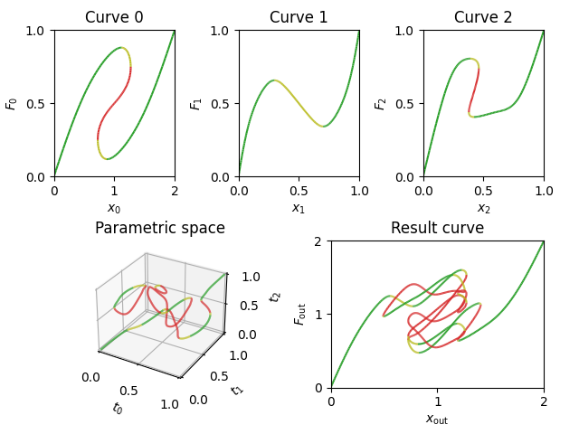
</p>

### Plotting Results

Visualize curve coupling stability results with `matplotlib`:

```python
import matplotlib.pyplot as plt
from matplotlib import colors as mcolors
from matplotlib import gridspec
from curveCoupling.utils import colored_line

fig = plt.figure()
plot_h = 2
gs = gridspec.GridSpec(2, plot_h * len(data))
axs = []

for i in range(0, len(data)):
    axs.append(fig.add_subplot(gs[0, plot_h * i:plot_h * (i + 1)]))
axs.append(fig.add_subplot(gs[1, len(data):]))
axs.append(fig.add_subplot(gs[1, :len(data)], projection='3d'))

custom_cmap = mcolors.LinearSegmentedColormap.from_list("custom_cmap", ["tab:red", "tab:olive", "tab:green"])
norm = mcolors.Normalize(vmin=-1, vmax=1)

for i, (d, s) in enumerate(zip(data, stability_input_lst)):
    colored_line(axs[i], s, d[:, 0], d[:, 1], cmap=custom_cmap, norm=norm)

for res, s in zip(res_lst, stability_analytic_lst):
    colored_line(axs[-1], s, res[:, 0], res[:, 1], res[:, 2], cmap=custom_cmap, norm=norm)

for out, s in zip(out_lst, stability_analytic_lst):
    colored_line(axs[-2], s, out[:, 0], out[:, 1], cmap=custom_cmap, norm=norm)

plt.show()
```

Alternatively, use the provided default plot, for an element:

```python
from curveCoupling.utils.defaultPlots import plot_stability
from matplotlib import pyplot as plt

ax = plt.subplot()
plot_stability(ax,data,stability)
plt.show()
```

For a network:

```python
from curveCoupling.utils.defaultPlots import plotResults_stability

fig = plt.figure()
axs = plotResults_stability(fig, data, stability_input_lst, out_lst, res_lst, stability_analytic_lst)
plt.show()
```

## License

This project is licensed under the GNU GENERAL PUBLIC LICENSE. See the [LICENSE](LICENSE) file for details.

## Contributing

Contributions are welcome! Feel free to open an issue or submit a pull request on GitHub.

## Contact

For questions or inquiries, please contact [Franco N. Pinan Basualdo](mailto:francopb.20@gmail.com).

